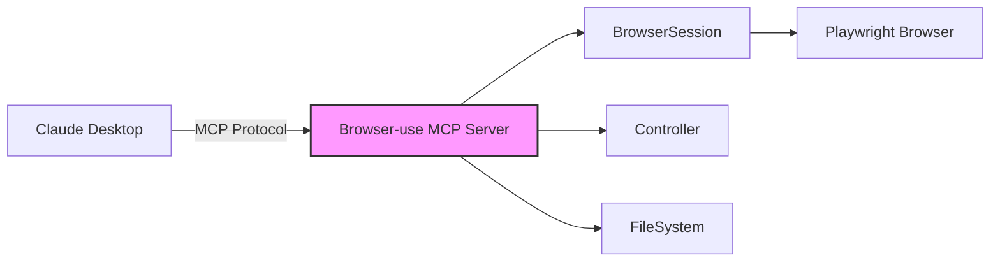

The MCP server exposes browser-use's browser automation capabilities as tools that can be used by AI assistants like Claude Desktop. This allows external MCP clients to control browsers, navigate websites, extract content, and perform automated tasks.

<Note>
  This is the opposite of the [MCP Client](/customize/mcp-client). The MCP client lets browser-use connect to external MCP servers, while this MCP server lets external AI assistants connect to browser-use.
</Note>

## Overview

The MCP server acts as a bridge between MCP-compatible AI assistants and browser-use:



## Installation

```bash
pip install "browser-use[mcp]"
```

## Quick Start

### 1. Configure Claude Desktop

Add browser-use to your Claude Desktop configuration:

<Tabs>
  <Tab title="macOS">
    Edit `~/Library/Application Support/Claude/claude_desktop_config.json`:
    ```json
    {
      "mcpServers": {
        "browser-use": {
          "command": "uvx",
          "args": ["browser-use", "--mcp"],
          "env": {
            "OPENAI_API_KEY": "sk-..."  // Optional: for content extraction
          }
        }
      }
    }
    ```
  </Tab>
  <Tab title="Windows">
    Edit `%APPDATA%\Claude\claude_desktop_config.json`:
    ```json
    {
      "mcpServers": {
        "browser-use": {
          "command": "uvx",
          "args": ["browser-use", "--mcp"],
          "env": {
            "OPENAI_API_KEY": "sk-..."  // Optional: for content extraction
          }
        }
      }
    }
    ```
  </Tab>
</Tabs>

### 2. Restart Claude Desktop

The browser-use tools will appear in Claude's tools menu (🔌 icon).

### 3. Use Browser Automation

Ask Claude to perform browser tasks:
- "Navigate to example.com and describe what you see"
- "Search for 'browser automation' on Google"
- "Fill out the contact form on this website"

## API Reference

### Available Tools

The MCP server exposes the following tools to MCP clients:

#### Navigation Tools

##### `browser_navigate`

Navigate to a URL.

```typescript
browser_navigate(url: string, new_tab?: boolean): string
```

**Parameters:**
| Parameter | Type | Required | Description |
|-----------|------|----------|-------------|
| `url` | `string` | Yes | URL to navigate to |
| `new_tab` | `boolean` | No | Open in new tab (default: false) |

**Returns:** Success message with URL

##### `browser_go_back`

Navigate back in browser history.

```typescript
browser_go_back(): string
```

**Returns:** "Navigated back"

#### Interaction Tools

##### `browser_click`

Click an element by index.

```typescript
browser_click(index: number, new_tab?: boolean): string
```

**Parameters:**
| Parameter | Type | Required | Description |
|-----------|------|----------|-------------|
| `index` | `number` | Yes | Element index from browser state |
| `new_tab` | `boolean` | No | Open link in new tab (default: false) |

**Returns:** Success message indicating click action

**Note:** When `new_tab` is true:
- For links: Extracts href and opens in new tab
- For other elements: Uses Cmd/Ctrl+Click

##### `browser_type`

Type text into an input field.

```typescript
browser_type(index: number, text: string): string
```

**Parameters:**
| Parameter | Type | Required | Description |
|-----------|------|----------|-------------|
| `index` | `number` | Yes | Element index from browser state |
| `text` | `string` | Yes | Text to type |

**Returns:** Success message with typed text

##### `browser_scroll`

Scroll the page.

```typescript
browser_scroll(direction?: "up" | "down"): string
```

**Parameters:**
| Parameter | Type | Required | Description |
|-----------|------|----------|-------------|
| `direction` | `"up" \| "down"` | No | Scroll direction (default: "down") |

**Returns:** "Scrolled {direction}"

#### State & Content Tools

##### `browser_get_state`

Get current browser state with all interactive elements.

```typescript
browser_get_state(include_screenshot?: boolean): string
```

**Parameters:**
| Parameter | Type | Required | Description |
|-----------|------|----------|-------------|
| `include_screenshot` | `boolean` | No | Include base64 screenshot (default: false) |

**Returns:** JSON string containing:
```json
{
  "url": "current page URL",
  "title": "page title",
  "tabs": [{"url": "...", "title": "..."}],
  "interactive_elements": [
    {
      "index": 0,
      "tag": "button",
      "text": "element text (max 100 chars)",
      "placeholder": "if present",
      "href": "if link"
    }
  ],
  "screenshot": "base64 if requested"
}
```

The interactive elements include all clickable and interactive elements on the page, with their:
- `index`: Used to reference the element in other commands (click, type)
- `tag`: HTML tag name (button, input, a, etc.)
- `text`: Visible text content, truncated to 100 characters
- `placeholder`: For input fields (if present)
- `href`: For links (if present)

##### `browser_extract_content`

Extract structured content from the current page using AI.

```typescript
browser_extract_content(query: string, extract_links?: boolean): string
```

**Parameters:**
| Parameter | Type | Required | Description |
|-----------|------|----------|-------------|
| `query` | `string` | Yes | What to extract (e.g., "all product prices") |
| `extract_links` | `boolean` | No | Include links in extraction (default: false) |

**Returns:** Extracted content based on query

**Note:** Requires `OPENAI_API_KEY` environment variable for AI extraction.

#### Tab Management Tools

##### `browser_list_tabs`

List all open browser tabs.

```typescript
browser_list_tabs(): string
```

**Returns:** JSON array of tab information:
```json
[
  {
    "index": 0,
    "url": "https://example.com",
    "title": "Page Title"
  }
]
```

##### `browser_switch_tab`

Switch to a specific tab.

```typescript
browser_switch_tab(tab_index: number): string
```

**Parameters:**
| Parameter | Type | Required | Description |
|-----------|------|----------|-------------|
| `tab_index` | `number` | Yes | Index of tab to switch to |

**Returns:** Success message with tab URL

##### `browser_close_tab`

Close a specific tab.

```typescript
browser_close_tab(tab_index: number): string
```

**Parameters:**
| Parameter | Type | Required | Description |
|-----------|------|----------|-------------|
| `tab_index` | `number` | Yes | Tab to close |

**Returns:** Success message with closed tab URL

### Tool Response Format

All tools return text content. Errors are returned as strings starting with "Error:".

## Configuration

### Environment Variables

Configure the MCP server behavior through environment variables in Claude Desktop config:

```json
{
  "mcpServers": {
    "browser-use": {
      "command": "python",
      "args": ["-m", "browser_use.mcp.server"],
      "env": {
        "OPENAI_API_KEY": "sk-..."  // For AI content extraction
      }
    }
  }
}
```

### Browser Profile Settings

The MCP server creates a browser session with these default settings:
- **Downloads Path**: `~/Downloads/browser-use-mcp/`
- **Wait Between Actions**: 0.5 seconds
- **Keep Alive**: True (browser stays open between commands)
- **Allowed Domains**: None by default (all domains allowed)

## Advanced Usage

### Running Standalone

Test the MCP server without Claude Desktop:

```bash
# Run server (reads from stdin, writes to stdout)
uvx browser-use --mcp

# The server communicates via JSON-RPC on stdio
```

### Security Considerations

<Warning>
  The MCP server provides full browser control to connected AI assistants. Consider these security measures:
</Warning>

1. **Domain Restrictions**: Currently not configurable via environment variables, but the server creates sessions with no domain restrictions by default
2. **File System Access**: The server creates a FileSystem instance at `~/.browser-use-mcp` for extraction operations
3. **Downloads**: Files download to `~/Downloads/browser-use-mcp/`

## Implementation Details

### Browser Session Management

- **Lazy Initialization**: Browser session is created on first browser tool use
- **Persistent Session**: Session remains active across multiple tool calls
- **Single Session**: Currently maintains one browser session per server instance

### Tool Categories

1. **Direct Browser Control**: Tools starting with `browser_` that directly interact with the browser
2. **Agent Tasks**: Currently commented out in implementation (`browser_use_run_task`)

### Error Handling

- All exceptions are caught and returned as text: `"Error: {message}"`
- Browser session initialization errors are returned to the client
- Missing dependencies (e.g., OPENAI_API_KEY) return descriptive error messages

## Troubleshooting

### Server Not Appearing in Claude

1. **Check configuration path:**
   - macOS: `~/Library/Application Support/Claude/claude_desktop_config.json`
   - Windows: `%APPDATA%\Claude\claude_desktop_config.json`

2. **Verify Python installation:**
   ```bash
   uvx browser-use --version
   uvx browser-use --mcp --help
   ```

3. **Check Claude logs:**
   - macOS: `~/Library/Logs/Claude/mcp.log`
   - Windows: `%APPDATA%\Claude\logs\mcp.log`

### Browser Not Launching

```bash
# Install Playwright browsers
playwright install chromium

# Test browser launch
python -c "from browser_use import BrowserSession; import asyncio; asyncio.run(BrowserSession().start())"
```

### Connection Errors

If you see "MCP server connection failed":

1. Test the server directly:
   ```bash
   uvx browser-use --mcp
   ```

2. Check all dependencies:
   ```bash
   pip install "browser-use[mcp]"
   ```

3. Ensure MCP SDK is installed:
   ```bash
   pip install mcp
   ```

### Content Extraction Not Working

If `browser_extract_content` returns errors:
1. Ensure `OPENAI_API_KEY` is set in the environment configuration
2. Verify the API key is valid
3. Check that you have credits/access to the OpenAI API

## Limitations

| Limitation | Description | Workaround |
|------------|-------------|------------|
| Single Browser Session | One browser instance per server | Restart server for new session |
| No Domain Restrictions Config | Cannot configure allowed domains via env vars | Modify server code if needed |
| No Agent Mode | `browser_use_run_task` is commented out | Use direct browser control tools |
| Text-Only Responses | All responses are text strings | Parse JSON responses client-side |

## Comparison with MCP Client

| Feature | MCP Server (this) | [MCP Client](/customize/mcp-client) |
|---------|-------------------|-------------------------------------|
| **Purpose** | Expose browser to AI | Connect agent to tools |
| **User** | Claude Desktop, etc. | Browser-use agents |
| **Direction** | External → Browser | Agent → External |
| **Configuration** | JSON config file | Python code |
| **Tools** | Fixed browser tools | Dynamic from server |
| **Use Case** | Interactive assistance | Automated workflows |

## Code Examples

- [Simple MCP client example](https://github.com/browser-use/browser-use/tree/main/examples/mcp/simple_server.py) - Basic MCP client connecting to browser-use server
- [Advanced MCP client example](https://github.com/browser-use/browser-use/tree/main/examples/mcp/advanced_server.py) - Multi-server orchestration and complex workflows

## See Also

- [MCP Client](/customize/mcp-client) - Connect browser-use to external MCP servers
- [Model Context Protocol](https://modelcontextprotocol.io) - MCP specification
- [Claude Desktop](https://claude.ai/download) - Primary MCP client
